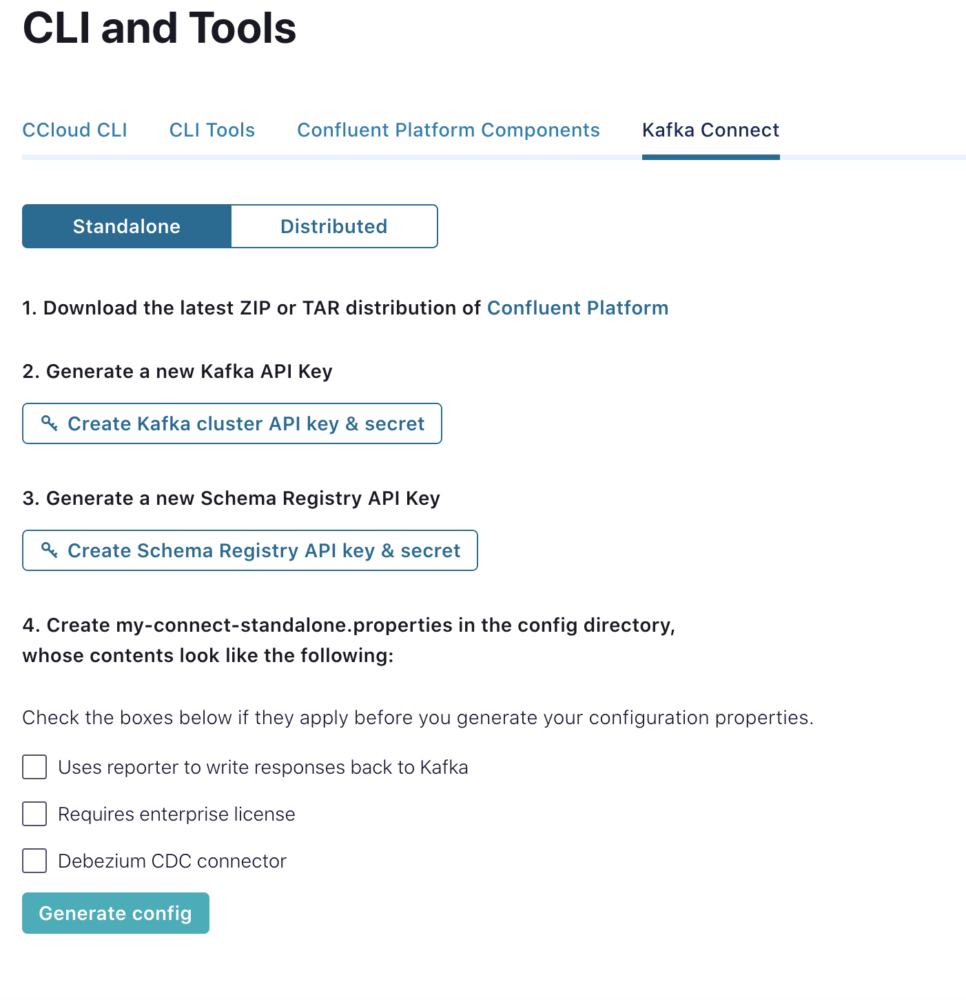

# sftp-ccloud

This will walk you through in creating a connect cluster integrated with your Confluent cloud cluster.

## Steps

- Install Confluent Platform

```bash
./install.sh
```

- install the sftp source connector into the connect cluster

```bash
./bin/confluent-hub install confluentinc/kafka-connect-sftp:2.2.4
```

- Generate your connect configuration from Confluent cloud and copy into a file called sftp-source.properties



- Genrate key with passphrase

```bash
ssh-keygen -P "mysecret" -f YOUR-PRIVATE-KEY
```

- Format private key to put into sftp-source.propereties

Copy the output if this command and paste the value in tls.private.key inside sftp-source.properties

```bash
./format-private-key.sh YOUR-PRIVATE-KEY
```

```properties
name=SchemaLessJsonSftp
tasks.max=1
connector.class=io.confluent.connect.sftp.SftpSchemaLessJsonSourceConnector
input.path=sftp/new/
error.path=sftp/err/
finished.path=sftp/finished/
input.file.pattern=.*.json
behavior.on.error=IGNORE
sftp.username={{YOUR USER NAME}}
tls.private.key={{OUTPUT OF THE FORMATTED PRIVATE KEY}}
tls.public.key={{YOUR PUBLIC KEY}}
tls.passphrase={{YOUR PASSPHRASE}}
sftp.host={{YOUR SFTP SERVER}}
sftp.port=22
kafka.topic=sftp-schemaless-json-topic
value.converter=org.apache.kafka.connect.storage.StringConverter
```

- Start the connect cluster

```bash
./bin/connect-standalone  ./connect-standalone.properties ./sftp-source.properties
```
